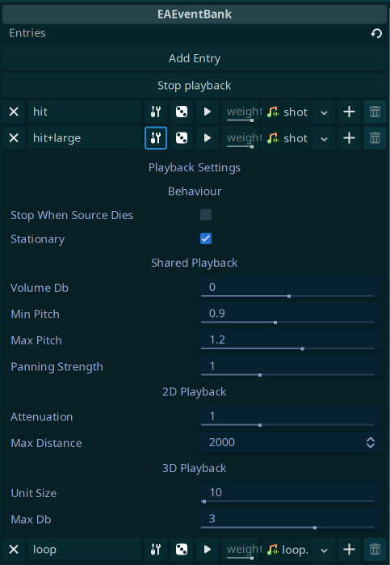

# Event Audio for Godot
A simple fire-and-forget audio triggering system for Godot.

- Create audio banks, linking event triggers with audio resources.
- Play audio with one line of code:
```gdscript
EventAudio.play3d("laser+shoot", my_player)
```
- If a trigger isn't found, nothing is played.

## Features
- Event based - add audio without modifying scenes or nodes.
- Works with 2D and 3D scenes.
- Works with GDScript and C#. 
- Multiple audio variants can be associated with a trigger. When triggered, a random choice will be picked.
- Triggers are searched for hierarchically the using `+` separator.
- Audio banks can be swapped out at runtime.

## Basic Workflow
It works as follows:
1. Build an Event Bank, which maps ‘audio event’ trigger strings to audio assets.


2. Mount the event bank in your scene somehow. There’s a helper node to do this, or you can do it programmatically.
3. In game, wherever you think you need audio trigger an audio event.

    ```
    # 2D example
    EventAudio.play_2d("hit", thing_playing_audio)

    # 3D example
    EventAudio.play_3d("hit", thing_playing_audio)
    ```

    In this example, the `thing_playing_audio` is the node that the audio is associated with.
4. In many cases, that’s largely it
    - Triggered audio will automatically track the position and lifetime of the node it’s associated with (optionally). 
    - Triggered audio will automatically clean up.
    - Triggering audio events that don’t exist is safe.

## Trigger lookups
The trigger lookup system is simple but powerful, based on left to right specialisation with a special separator character `+`.

For example, if an audio bank contains: 
- `FOO` -> Sample 1.
- `FOO+BAR` -> Sample 2

Triggering `FOO+BAR` will trigger Sample 2.
Triggering `FOO+QUX` will trigger Sample 1.
Triggering `BAZ` will trigger nothing.

This allows an audio designer to populate the audio space quickly with triggers like `HIT`, `COLLISION`, `DAMAGE`, `FOOTSTEP`, etc, and then specialise them for `HIT+WALL`, `HIT+WOOD`, as necessary.

## Other features
- **Variants**. For each audio event, multiple audio assets can be associated. When the event is triggered, one will be selected at random. Each of these variants can be given a different weight, to make them more or less likely to be played.
- **Pitch randomisation**. Optionally set a min and max pitch for each event.
- **Optional source position tracking**. If an audio source is supplied with the event, by default the audio will track the position of the source. This isn’t what is always wanted, however, so the event can be flagged as stationary.
- **Optional source lifetime tracking**. By default, audio will play until it finishes. If it should terminate when the source is killed, this can also be flagged in the event bank.
- **2D and 3D playback settings**. Playback settings like volume, panning strength and attenuation can be set in the event.
- **Bank editor**. All these options are kept together in the details panel of the bank event editor:
    
- **Manual control**. When an event is triggered, it returns a handle to the resulting audio player, which can be manipulated  programmatically as normal. This can be handy in the case of e.g. looping audio.
 

# Installation and Usage
- Download from the Godot Asset Library.
- Import the plugin into your Godot project.
- Enable the plugin in your project settings.
